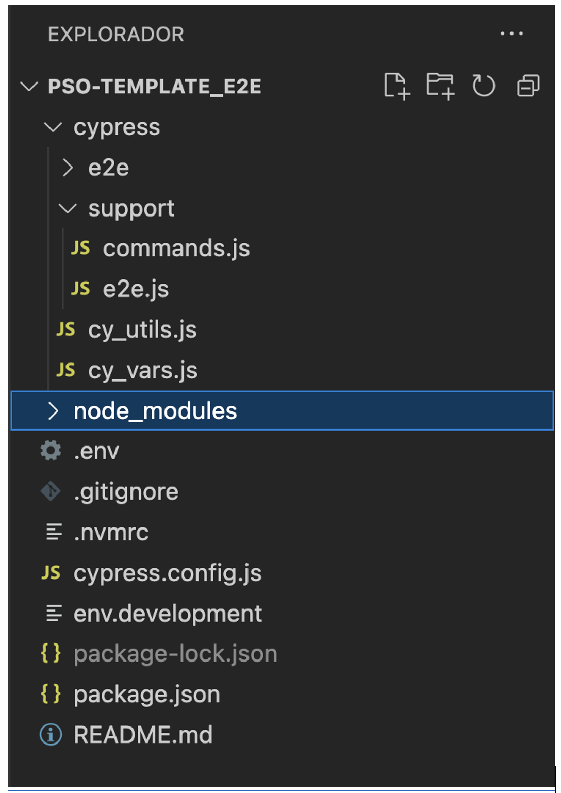

# Testing methodology
- [Intro](./e2e-testing.md)
- Configure Cypress
- [Configure GHA](./gha-config.md)

# Cypress installation/configuration <a name="cypress-install"></a>


## What is Cypress <a name="cypress-intro"></a>

Cypress is a purely JavaScript-based front end testing tool built for the modern web. It aims to address the pain points developers or QA engineers face while testing an application. Cypress is a more developer-friendly tool that uses a unique DOM manipulation technique and operates directly in the browser. Cypress also provides a unique interactive test runner in which it executes all tests and provides reporting and artifacts for failing tests.

## Installation

Depending on your application you can create your e2e tests as part of the SPA repo or in a completely new repo.

To install Cypress, follow the steps provided in the official documentation: https://docs.cypress.io/guides/getting-started/installing-cypress

Make sure to also install any other cypress dependencies required in case they are not installed by default on your machine: https://docs.cypress.io/guides/continuous-integration/introduction#Dependencies

Node.js is an open-source, cross-platform, back-end JavaScript runtime environment that runs on the V8 engine and executes JavaScript code outside a web browser.
The official download page is:
https://nodejs.org/en/download/

Npm is the default package management system for Node.js. Npm is installed with Node.js. For more information, the official webpage is:
https://www.npmjs.com/

## Project files



- E2E Folder. 
  This is the folder where the scripts developed for the automatic tests will be included.
- Support Folder. 
  This is the folder where some auxiliary files are included that will be used to execute the automatic scripts. Some auxiliary files that may appear in the folder:<br>
      •	e2e.js. File to indicate the paths of the files in this folder.<br>
      • commands.js. File for creating custom commands and overwriting existing commands. For more information:
        https://docs.cypress.io/api/cypress-api/custom-commands<br>
- cy.utils.js
  Is a file with helper methods for code reuse between scripts.
- cy.vars.js
  Is a file with variables to be used in the project scripts.
- package.json
  A package.json is a Json file that exists at the root of a Javascript/Node project. It holds metadata relevant to the project and it is used for managing the project’s dependencies.
- env.development
  The env.development file is used to include environment variables that will be used throughout the project. Some environment variables that may appear in the file:<br>
    •	CYPRESS_BASE_URL. URL against which the automatic tests will be launched.<br>
    •	CYPRESS_TEST_LOGIN_USERNAME. Username for login.<br>
    •	CYPRESS_TEST_LOGIN_PASSWORD. Password for login.<br>
  Depending on the project, there may be other environment variables necessary for the execution of the automatic tests.
- .gitigone
  The .gitignore file tells Git which files to ignore when committing your project to the GitHub repository. .gitignore is located in the root directory of the repository. For example, this file includes the storage paths for screenshots, videos, or test results that Cypress generates with each run.
- cypress.config.js
  Is a file with the Cypress configuration which is created the first time Cypress is run in the project. This file can include some custom methods like getters and setters
- readme.md
  A Readme file is an essential guide that gives other developers a detailed description of the GitHub project

## Writing tests

We recommend writing e2e tests for the happy paths/desired functionality of the application. Covering edge cases will involve a lot more work and might cause issues further down the line as an application expands.

## Writing specs
Based on the tests defined in the previous steps we can then define feature specs to be run. In our case we have 1 spec testing the entire application.

A spec creating assets would look like:
```
import './article_dates.cy.js';
import './check_author.cy.js';
import './phone_number.cy.js';
import './required_file.cy.js';
```

## Commands

We also create a set of generic commands that can be called during test executions to perform common tasks (such as authentication and navigation to certain paths). These are added in the `support` folder.

[Example of our commands file](../../support/commands.js)

## ENV configuration

Configure your requirements env variables. The amount and type of variables will depend from project to project, however a minumim of 3 should be included:
```
CYPRESS_BASE_URL= Base URL on which cypress needs to perform the tests
CYPRESS_TEST_LOGIN_USERNAME= Test username used in authentication if required
CYPRESS_TEST_LOGIN_PASSWORD= Password used in authentication if required
```

`CYPRESS_BASE_URL` should be base path of your local, dev, sandbox, or stg environment SPA.

Add the declared envs into the `cypress/cy_vars.js` file. You can also provide default values at this point if needed:

```
CY_TARGET: Cypress.env('TEST_APP_BASE_URL') || 'http://localhost:3000',
CY_LOGIN_USERNAME: Cypress.env('TEST_LOGIN_USERNAME'),
CY_LOGIN_PASSWORD: Cypress.env('TEST_LOGIN_PASSWORD'),
```
