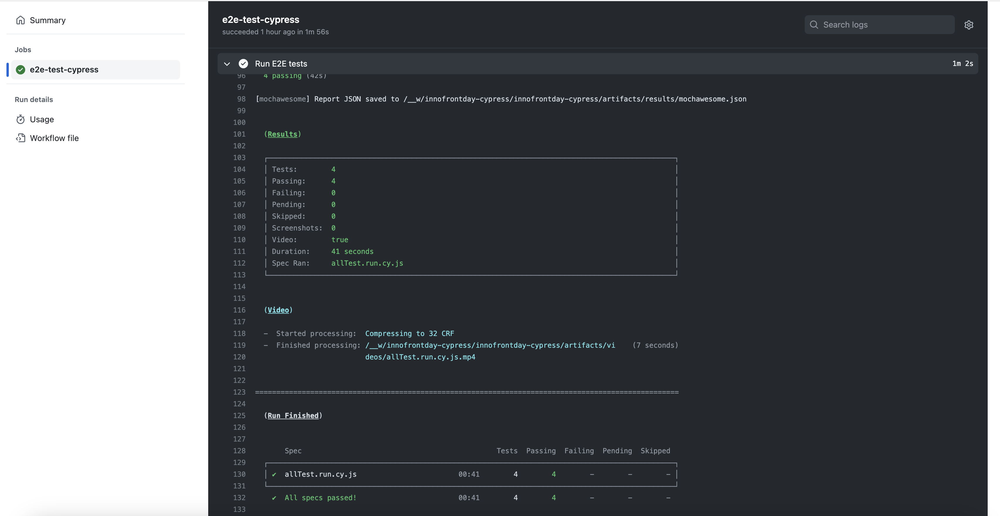
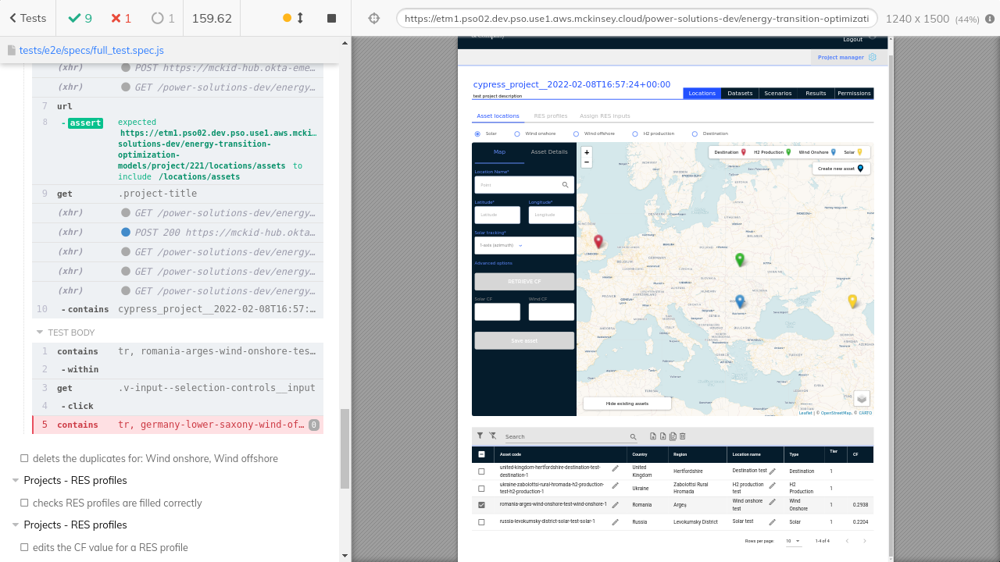
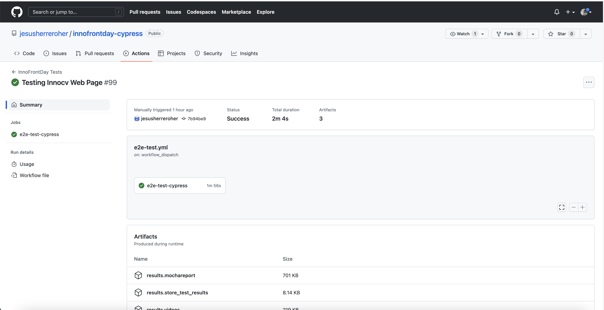

# Testing methodology
- Intro
- [Configure Cypress](./cypress-config.md)
- [Configure GHA](./gha-config.md)

# E2E testing

E2E tests are a very powerful tool in ensuring the code developed and deployed behaves according to the requirements. It also serves as an early warning system in case a system issue is introduced in the code or if a particular feature dows not behave as intended.

Unit and E2E tests can be run by developers locally every time development on a feature is finished to ensure the new code does not impact the existing functionality.

Ideally when developing new functionality a test set of tests for that should also be created to ensure the "happy paths" are covered.

Most times the live environment will be different to the local development environment (authentication, user management, 3rd party interactions etc.), so running the tests locally might not be enough. E2E tests can also be ran automatically on CI once a deployment is completed in a particular environment to validate the deployment behaves as intended and no functionality issues exist on the happy path of the application.

## How to validate a deploy 

Running Cypress tests on GHA on a live environment has multiple benefits, the main one being assuring a deployment went as intended, and the functionality of the deployed code across ALL pods is correct. 

Using this method, DEV & QA teams and product owners can verify deployments to ensure the code runs as intended after a deployment without having to spend hours manually checking every feature.

## Example of test reports from Git Hub Actions 

If any issues are detected after a deploy, they will be easily visible in GHA with details of how the tests failed or not:

Cypress will also take screenshots/videos at the points of failure so the steps required to reproduce the issue can be done manually:

Each defined testsuite will also generate a vide recording of the entire test run and it can be save in GHA, this way the workflow will also indicate the exact steps required to reproduce a failing test as well as provide proof of functionality for the passing tests:

